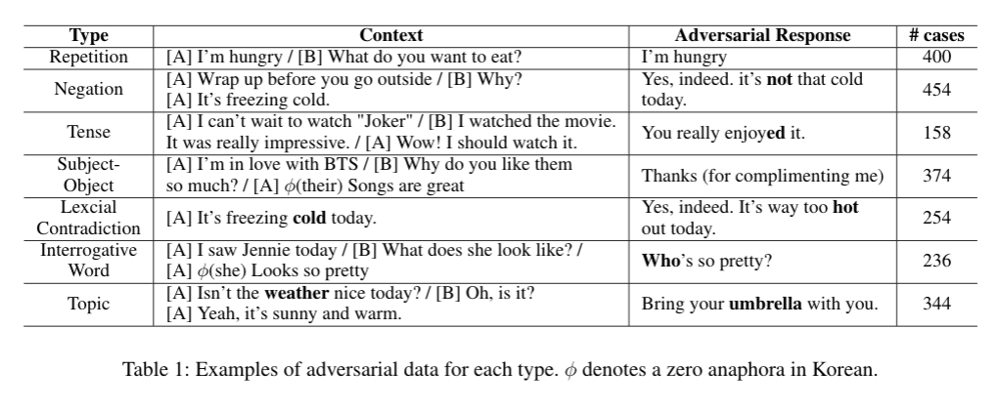

# Adversarial Test Dataset for Korean Multi-turn Response Selection

This is the repository for adversarial test dataset used in our EMNLP 2021 paper [*An Evaluation Dataset and Strategy for Building Robust Multi-turn Response Selection Model*](https://aclanthology.org/2021.emnlp-main.180.pdf). This dataset and strategy of the paper were utilized to develop several systems, including open-domain chatbot [외개인아가](https://pf.kakao.com/_lKxoMT).

한국어 오픈 도메인 대화 답변 선택 모델의 취약점을 평가하기 위한 데이터셋입니다. 해당 데이터셋에 대한 상세 내용과 강건한 한국어 오픈 도메인 챗봇 답변 선택 모델 구축을 위한 전략은 EMNLP 2021 논문 [*An Evaluation Dataset and Strategy for Building Robust Multi-turn Response Selection Model*](https://aclanthology.org/2021.emnlp-main.180.pdf) 및 해당 논문을 설명한 [블로그 포스트](
https://kakaoenterprise.github.io/papers/emnlp-evaluation-dataset-and-strategy)에서 확인하실 수 있습니다.


## Overview


Each test case consists of the dialogue context, one positive response (label 1), and one negative response (label 0) as follows.
> An example in dataset/negation.jsonl
<pre>
{
  "context":["아 너무 힘들다.", "오늘 뭐 했어요?", "회사 갔다가 이제 집 왔어요."]
  "candidates": [
     {"text": "고생많았네.", "label": 1}, 
     {"text": "회사 <i><b>안</b></i> 갔어?", "label": 0}
  ],
  ...
}
</pre>


There are a total of 2,220 test cases, and each test case are classified by seven types.

## Adversarial Types

* **Repetition** An incorrect response repeating one of the utterances in the context.

* **Negation**  A negation is either added to or omitted from a correct response, generating an erroneous response with reversed affirmative or negative meaning. A test set for a negation error intentionally generates a negative response by adding or removing ‘안’ or ‘못’, which are negative adverbs in Korean (short-form negation) or ‘-지 않다,’ ‘-지 못하다, ’ or ‘-지 말다’ which are negative auxiliary predicates in Korean (Long-form negation) in order to test whether the model understands such semantic reversal.

* **Tense** A morpheme or expression marking tense is added to or removed from a correct response, generating an erroneous response in tense that is inconsistent with the given context. A test set for tense errors adds or replaces morphemes or expressions marking the future tense such as ‘-겠-,’  or ones marking the past tense such as‘-었-’ to test whether the model fully understands the context disconnection triggered by such tense change. 

* **Subject-Object**  A test set for subject-object errors generates a response inconsistent with the context due to confusion of the subject and object for a certain action. In particular, since zero anaphora can be found frequently in Korean sentences, incorrect responses are often made because of a failure in identifying the hidden subject of the previous context. This test set uses a subject or an object differently from the ones used in a correct response to examine whether the model fully understands the context disconnection caused by such errors.

* **Lexical Contradiction** A key lexicon of a correct response is replaced with one that holds either conflicting or opposite meaning against the said key lexicon, generating an incorrect response. A test set for lexical contradiction errors replaces a key lexicon in a sentence with an antonym (e.g. hot vs cold) or a word that cannot be used instead (e.g. rain vs snow) to check whether the model understands the precise meaning of such lexicon. 

* **Interrogative Word** A test set for interrogative word errors generates a response in a form of 5W1H questions to ask for information that has already been explicitly or implicitly shared in previous dialogues.

* **Topic** A key sentence or vocabulary is replaced with another sentence or term that does not fit in the previous context even though they frequently appear together in the given topic. While this error is similar to the lexical contradiction error to a certain extent, the replacement words used in this test do not hold conflicting or opposite meanings but instead have less semantic relevance to the context of the previous dialogue (e.g. sunny vs umbrella). The test set assesses whether a model fully understands the fact that while the replacement vocabulary is the one that is frequently used in the same given topic, the response does not correctly reflect the context of the previous dialogue.


## Citation
If you use this in your research, please cite as:
```bibtex
@inproceedings{han2021advmrs,
  title={An Evaluation Dataset and Strategy for Building Robust Multi-turn Response Selection Model},
  author={Han, Kijong and Lee, Seojin and Lee, Wooin and Lee, Joosung and Lee, Dong-hun},
  booktitle={Proceedings of the 2021 Conference on Empirical Methods in Natural Language Processing (EMNLP)},
  year={2021}
}
```

## Contact
nlp.en@kakaoenterprise.com 
